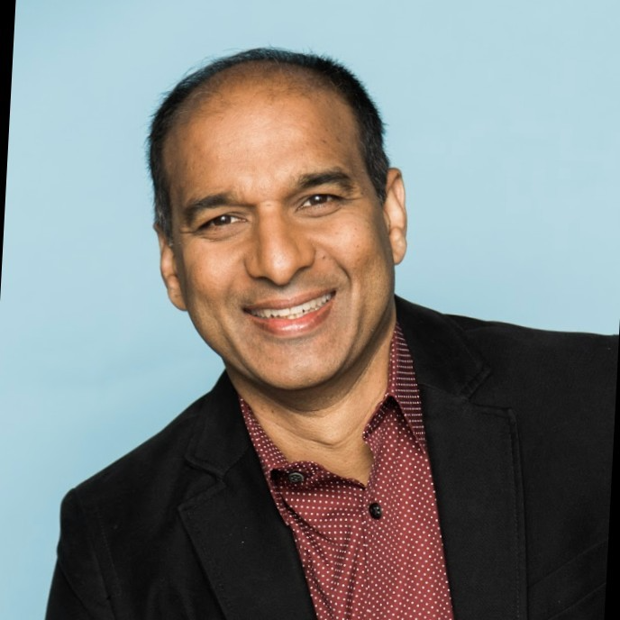
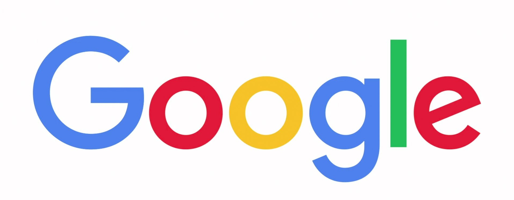
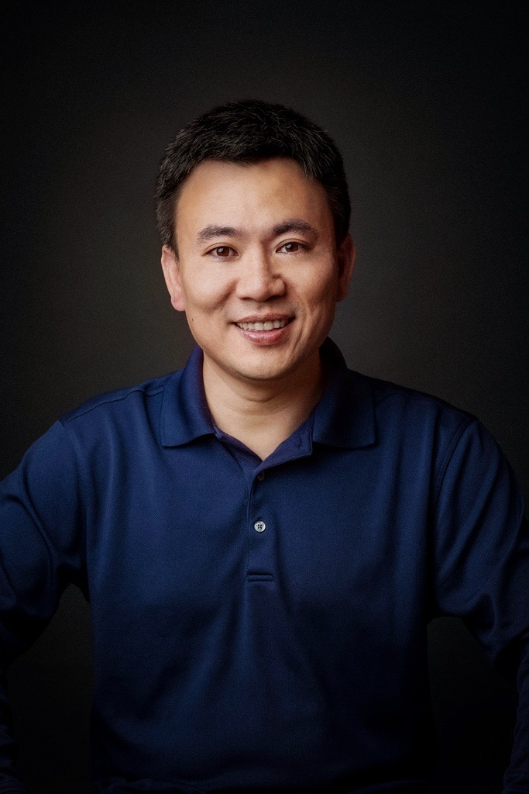

## Prospective Students

- Join the 25K+ global community of Agentic AI MOOC and sign up for the course: <a href="https://forms.gle/gKFNDMiUBaKddUh36">Signup Form</a>
<!-- - Join our <a href="">Agentic AI Discord</a> to stay updated on future MOOCs. -->
- Check out the <a href="https://rdi.berkeley.edu/events/agentic-ai-summit">Agentic AI Summit</a> to learn more about the latest developments in agentic AI.
- This course is built upon the fundamentals from the [Fall 2024 LLM Agents MOOC](https://llmagents-learning.org/f24) and [Spring 2025 Advanced LLM Agents MOOC](https://llmagents-learning.org/sp25).

## Course Staff

<table class="instructors">
  <tbody>
    <tr>
      <td>Instructor</td>
      <td>(Guest) Co-instructor</td>
    </tr>
    <tr>
      <td></td>
      <td></td>
    </tr>
    <tr>
      <td><a href="https://people.eecs.berkeley.edu/~dawnsong/">Dawn Song</a></td>
      <td>Xinyun Chen</td>
    </tr>
    <tr>
      <td>Professor, UC Berkeley</td>
      <td>Research Scientist, Meta</td>
    </tr>
  </tbody>
</table>

## Guest Speakers

<table class="speakers">
  <tr>
    <td>
      
      
Yann Dubois

      

    </td>
    <td>
      
      
Yangqing Jia

      

    </td>
    <td>
      
      
Jiantao Jiao

      

    </td>
  </tr>

  <tr>
    <td>
      
      
Rao Surapaneni

      

    </td>
    <td>
      
      
Weizhu Chen

      

    </td>
    <td>
      
      
Noam Brown

      

    </td>
  </tr>

  <tr>
    <td>
      
      
Oriol Vinyals

      

    </td>
    <td>
      
      
Pushmeet Kohli

      

    </td>
    <td>
      
      
Peter Stone

      

    </td>
  </tr>
</table>

## Class Time and Location

Lecture: 3-5pm PT Monday (starts Sep 15, 2025)

## Course Description

Agentic AI is the new frontier and poised to transform the future of our daily life with the support of intelligent task automation and personalization. In this course, we will first discuss fundamental concepts that are essential for Agentic AI, including the foundation of LLMs, reasonsing, planning, agentic frameworks and infrastructure. We will also cover representative agent applications, including code generation, robotics, web automation, and scientific discovery. Meanwhile, we will discuss limitations and potential risks of current LLM agents, and share insights into directions for further improvement.

## Syllabus

To be announced soon!
