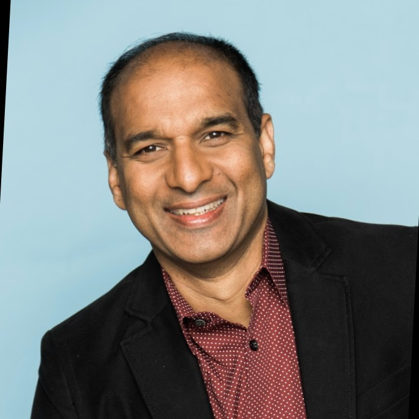
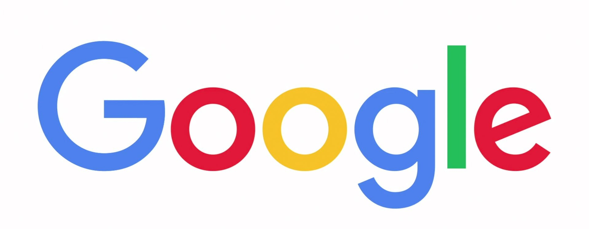

## Prospective Students

- Join the 25K+ global community of Agentic AI MOOC and sign up for the course: <a href="https://forms.gle/gKFNDMiUBaKddUh36">Signup Form</a>
<!-- - Join our <a href="">Agentic AI Discord</a> to stay updated on future MOOCs. -->
- Check out the <a href="https://rdi.berkeley.edu/events/agentic-ai-summit">Agentic AI Summit</a> to learn more about the latest developments in agentic AI.
- This course is built upon the fundamentals from the [Fall 2024 LLM Agents MOOC](https://llmagents-learning.org/f24) and [Spring 2025 Advanced LLM Agents MOOC](https://llmagents-learning.org/sp25).

## Course Staff

<table class="instructors">
  <tbody>
    <tr>
      <td>Instructor</td>
      <td>(Guest) Co-instructor</td>
    </tr>
    <tr>
      <td></td>
      <td></td>
    </tr>
    <tr>
      <td><a href="https://people.eecs.berkeley.edu/~dawnsong/">Dawn Song</a></td>
      <td>Xinyun Chen</td>
    </tr>
    <tr>
      <td>Professor, UC Berkeley</td>
      <td>Research Scientist, Meta</td>
    </tr>
  </tbody>
</table>

## Guest Speakers

<table class="speakers">
  <tr>
    <td>
      

        
        
Yann Dubois

        
Member of Technical Staff

        

      

    </td>
    <td>
      

        
        
Yangqing Jia

        
VP, Al System Software

        

      

    </td>
    <td>
      

        
        
Jiantao Jiao

        
Director of Research & Distinguished Scientist

        

      

    </td>
  </tr>

  <tr>
    <td>
      

        
        
Rao Surapaneni

        
VP/GM - Business Application Platform

        

      

    </td>
    <td>
      

        
        
Weizhu Chen

        
Technical Fellow & CVP

        

      

    </td>
    <td>
      

        
        
Noam Brown

        
 Research Scientist

        

      

    </td>
  </tr>

  <tr>
    <td>
      

        
        
Oriol Vinyals

        
VP of Research

        

      

    </td>
    <td>
      

        
        
Pushmeet Kohli

        
VP, Science and Strategic Initiatives

        

      

    </td>
    <td>
      

        
        
Peter Stone

        
Chief Scientist at Sony Al, Professor at UT Austin

        

      

    </td>
  </tr>
</table>

## Class Time and Location

Lecture: 3-5pm PT Monday (starts Sep 15, 2025)

## Course Description

Agentic AI is the new frontier and poised to transform the future of our daily life with the support of intelligent task automation and personalization. In this course, we will first discuss fundamental concepts that are essential for Agentic AI, including the foundation of LLMs, reasonsing, planning, agentic frameworks and infrastructure. We will also cover representative agent applications, including code generation, robotics, web automation, and scientific discovery. Meanwhile, we will discuss limitations and potential risks of current LLM agents, and share insights into directions for further improvement.

## Syllabus

<table class="schedule-table">
  <thead>
    <tr>
      <th>Date</th>
      <th>Lecture</th>
      <th>Speaker</th>
      <th>Readings</th>
    </tr>
  </thead>
  <tbody>
    <tr>
      <td>Sep 15</td>
      <td>
        LLM Agents Overview
        
<a href="https://www.youtube.com/live/hBv9ZLURWp8">Livestream Part 1</a>

        
<a href="https://www.youtube.com/live/G5VANF-lZ2Q">Livestream Part 2</a>

        
<a href="{{ site.baseurl }}/slides/lecture1.pdf">slides</a>

      </td>
      <td>Yann Dubois, OpenAI</td>
      <td>
        
<a href="{{ site.baseurl }}/slides/d11.pdf">reading1</a>

        
<a href="{{ site.baseurl }}/slides/d22.pdf">reading2</a>

      </td>
    </tr>
    <tr>
      <td>Sep 22</td>
      <td>Agent Stack &amp; Infrastructure</td>
      <td>Yangqing Jia, NVIDIA</td>
      <td>—</td>
    </tr>
    <tr>
      <td>Sep 29</td>
      <td>LLM with Tool Use</td>
      <td>Jiantao Jiao, NVIDIA</td>
      <td>—</td>
    </tr>
    <tr>
      <td>Oct 6</td>
      <td>TBD</td>
      <td>Armand Joulin, Google DeepMind</td>
      <td>—</td>
    </tr>
    <tr>
      <td>Oct 13</td>
      <td>TBD</td>
      <td>Weizhu Chen, Microsoft</td>
      <td>—</td>
    </tr>
    <tr>
      <td>Oct 20</td>
      <td>TBD</td>
      <td>Noam Brown, OpenAI</td>
      <td>—</td>
    </tr>
    <tr>
      <td>Oct 27</td>
      <td>TBD</td>
      <td>TBD</td>
      <td>—</td>
    </tr>
    <tr>
      <td>Nov 3</td>
      <td>TBD</td>
      <td>Rao Surapaneni, Google</td>
      <td>—</td>
    </tr>
    <tr>
      <td>Nov 10</td>
      <td>TBD</td>
      <td>Oriol Vinyals, Google DeepMind</td>
      <td>—</td>
    </tr>
    <tr>
      <td>Nov 17</td>
      <td>TBD</td>
      <td>Pushmeet Kohli, Google DeepMind</td>
      <td>—</td>
    </tr>
    <tr>
      <td>Nov 24</td>
      <td>TBD</td>
      <td>Peter Stone, UT Austin</td>
      <td>—</td>
    </tr>
    <tr>
      <td>Dec 1</td>
      <td>Agentic AI Safety &amp; Security</td>
      <td>Dawn Song, UC Berkeley</td>
      <td>—</td>
    </tr>
    <tr>
      <td>Dec 8</td>
      <td>No lecture (RRR week)</td>
      <td>—</td>
      <td>—</td>
    </tr>
  </tbody>
</table>
