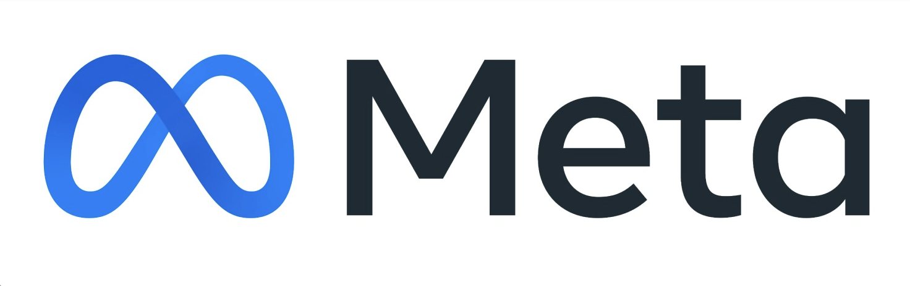
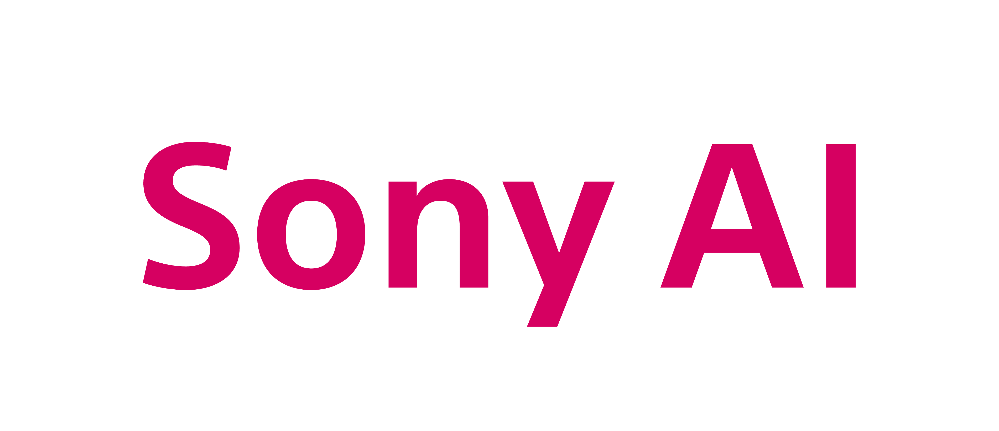

## Prospective Students

- Join the 32K+ global community of Agentic AI MOOC and sign up for the course: <a href="https://forms.gle/gKFNDMiUBaKddUh36" style="color: #dc3545; font-weight: bold;">Signup Form</a>
- Join our <a href="https://discord.gg/FaMW9Hsf">LLM Agents Discord</a> to stay updated
- Check out the <a href="https://rdi.berkeley.edu/events/agentic-ai-summit">Agentic AI Summit</a> to learn more about the latest developments in agentic AI.
- This course is built upon the fundamentals from the [Fall 2024 LLM Agents MOOC](https://llmagents-learning.org/f24) and [Spring 2025 Advanced LLM Agents MOOC](https://llmagents-learning.org/sp25).

## Course Staff

<table class="instructors">
  <tbody>
    <tr>
      <td>Instructor</td>
      <td>(Guest) Co-instructor</td>
    </tr>
    <tr>
      <td></td>
      <td></td>
    </tr>
    <tr>
      <td><a href="https://people.eecs.berkeley.edu/~dawnsong/">Dawn Song</a></td>
      <td>Xinyun Chen</td>
    </tr>
    <tr>
      <td>Professor, UC Berkeley</td>
      <td>Research Scientist, Meta</td>
    </tr>
  </tbody>
</table>

## Guest Speakers

<table class="speakers">
  <tr>
    <td>
      

        
        
Yann Dubois

        
Member of Technical Staff

        

      

    </td>
    <td>
      

        
        
Yangqing Jia

        
VP, Al System Software

        

      

    </td>
    <td>
      

        
        
Jiantao Jiao

        
Director of Research & Distinguished Scientist

        

      

    </td>
  </tr>

  <tr>
    <td>
      

        
        
Weizhu Chen

        
Technical Fellow & CVP

        

      

    </td>
    <td>
      

        
        
Noam Brown

        
 Research Scientist

        

      

    </td>
    <td>
      

        
        
Sida Wang

        
Research Scientist

        

      

    </td>
  </tr>

  <tr>
    <td>
      

        
        
James Zou

        
Professor

        

      

    </td>
    <td>
      

        
        
Oriol Vinyals

        
VP, Research

        

      

    </td>
    <td>
      

        
        
Peter Stone

        
Chief Scientist at Sony Al, Professor at UT Austin

        

      

    </td>
  </tr>
</table>

## Class Time and Location

Lecture: 3-5pm PT Monday (starts Sep 15, 2025)

## Course Description

Agentic AI is the new frontier and poised to transform the future of our daily life with the support of intelligent task automation and personalization. In this course, we will first discuss fundamental concepts that are essential for Agentic AI, including the foundation of LLMs, reasonsing, planning, agentic frameworks and infrastructure. We will also cover representative agent applications, including code generation, robotics, web automation, and scientific discovery. Meanwhile, we will discuss limitations and potential risks of current LLM agents, and share insights into directions for further improvement.

## Syllabus

<table style="width: 100%; table-layout: fixed;">
<thead>
<tr>
<th style="width: 15%;">Date</th>
<th style="width: 35%;">Lecture   (3:10PM-5:00PM PT)</th>
<th style="width: 50%;">Supplemental Readings</th>
</tr>
</thead>
<tbody>
<tr>
<td>Sep 15</td>
<td><strong>LLM Agents Overview</strong>   Yann Dubois, OpenAI   <a href="{{ site.baseurl }}/slides/lecture1.pdf">Slides</a> <a href="https://www.youtube.com/watch?v=btq1TqMFrxE&list=PLS01nW3RtgoqGkm4UeqNeZLccW-OGc1fJ&index=1&t=1s">Recording</a> <a href="https://docs.google.com/forms/d/e/1FAIpQLSeiynequI8mmo_5Ab4dUd4mtMOLkLMnxDA9MgLKQ7PBxlMMbQ/viewform?usp=header">Quiz</a></td>
<td>- <a href="{{ site.baseurl }}/slides/d11.pdf">KIMI K2: Open Agentic Intelligence</a>   - <a href="{{ site.baseurl }}/slides/d22.pdf">DeepSeek-V3 Technical Report</a></td>
</tr>
<tr>
<td>Sep 22</td>
<td><strong>Evolution of system designs from an AI engineer perspective</strong>   Yangqing Jia, NVIDIA   <a href="{{ site.baseurl }}/slides/Yangqing.pdf">Slides</a> <a href="https://www.youtube.com/watch?v=xqRAS6rAouo&list=PLS01nW3RtgoqGkm4UeqNeZLccW-OGc1fJ&index=3">Recording</a> <a href="https://docs.google.com/forms/d/e/1FAIpQLSenZmQiSucrpI8m0QeicoKklE_lMOzBq30EZmpBH2YRDl0taA/viewform?usp=header">Quiz</a></td>
<td></td>
</tr>
<tr>
<td>Sep 29</td>
<td><strong>Post-Training Verifiable Agents</strong>   Jiantao Jiao, NVIDIA   <a href="https://youtube.com/live/3l0Zxus34es?feature=share">Live Stream</a></td>
<td>- <a href="https://openai.com/index/introducing-swe-bench-verified/">Introducing SWE-bench Verified</a>   - <a href="https://openai.com/index/browsecomp/">BrowseComp: a benchmark for browsing agents</a></td>
</tr>
<tr>
<td>Oct 6</td>
<td><strong>Agent Evaluation & Project Overview</strong></td>
<td></td>
</tr>
<tr>
<td>Oct 13</td>
<td>Weizhu Chen, Microsoft</td>
<td></td>
</tr>
<tr>
<td>Oct 20</td>
<td>Noam Brown, OpenAI</td>
<td></td>
</tr>
<tr>
<td>Oct 27</td>
<td>Sida Wang, Meta</td>
<td></td>
</tr>
<tr>
<td>Nov 3</td>
<td>James Zou, Stanford</td>
<td></td>
</tr>
<tr>
<td>Nov 10</td>
<td>Oriol Vinyals, Google DeepMind</td>
<td></td>
</tr>
<tr>
<td>Nov 17</td>
<td><em>TBA</em></td>
<td></td>
</tr>
<tr>
<td>Nov 24</td>
<td>Peter Stone, UT Austin / Sony AI</td>
<td></td>
</tr>
<tr>
<td>Dec 1</td>
<td><strong>Agentic AI Safety & Security</strong>   Dawn Song, UC Berkeley</td>
<td></td>
</tr>
<tr>
<td>Dec 8</td>
<td><strong>No lecture — RRR week</strong></td>
<td></td>
</tr>
</tbody>
</table>

&nbsp;
## Completion Certificate

Course completion certificates will be awarded to students based on the rules of the following tiers. All assignments are due late December (tentatively December 16th, 2025 at 11:59PM PDT). To receive your certificate please complete the Certificate Declaration Form by late December (tentatively December 16th, 2025 at 11:59PM PDT). This form will be released in November.

**Trailblazer Tier:**
- Complete all lecture quizzes associated with each lecture
- Pass the written article assignment

**Mastery Tier:**
- Complete all lecture quizzes associated with each lecture
- Pass the written article assignment
- Submit a project to the AgentBeats competition

**Legendary Tier:**
- Complete all lecture quizzes associated with each lecture
- Pass the written article assignment
- Become a winner or finalist at the AgentBeats competition

**Honorary Tier:**
- For the most helpful/supportive students in Discord!
- Meets all other coursework requirements of Mastery Tier

### Earn Your Certificate in 3 Steps

**STEP 1.** Complete all of the coursework for your desired tier.
- All assignments are due late December (tentatively December 16th, 2025 at 11:59PM PDT)
- We track your progress throughout the course via your email. Please use the same email address when submitting all coursework
- All assignments should send a Google Forms confirmation email on successful submission

**STEP 2.** Complete the Certificate Declaration Form.
- In order to earn the certificate, all students will need to complete a Certificate Declaration Form by late December (tentatively December 16th, 2025 at 11:59PM PDT)
- This form will be released in November

**STEP 3.** Certificates will be sent to your email in Spring 2026!

_NOTE: You can only earn one certificate from this course (not counting Honorary Tier). Completing the assignments associated with this course in order to earn a Completion Certificate is completely optional. You are more than welcome to just watch the lectures and audit the course!_

## Coursework

All coursework will be released and submitted through the course website.

### Quizzes

All quizzes are released shortly after the corresponding lecture and are graded on completion. Please remember to complete the quiz each week. Although it's graded on completion, we encourage you to do your best. The questions are all multiple-choice and there are usually 5 per quiz. The quizzes will be posted in the Syllabus section.

### Written Article

Create a social media post (X/LinkedIn/etc) of roughly 500 words. Include the link to our MOOC website in the article and post.

- Students in the Trailblazer Tier should either summarize information from one of the lecture(s) or write a postmortem on their learning experience during our MOOC
- Students in the Mastery or Legendary Tier should write about their AgentBeats submission

The written article is an effort-based assignment that will be graded as pass or no pass (P/NP). The submission form will be released later – stay tuned!

### Project

More information about the project will be released later.

    
Questions?

    
We are so excited to have you join us this semester! If you have any questions, please reach out to the course staff in our <a href="https://discord.gg/FaMW9Hsf" style="color: #4CAF50; font-weight: bold;">LLM Agents Discord</a>.

